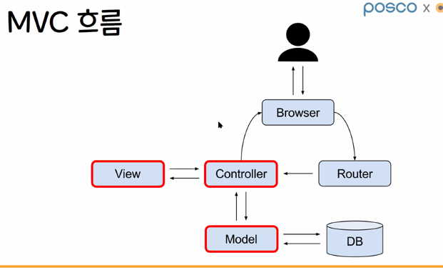
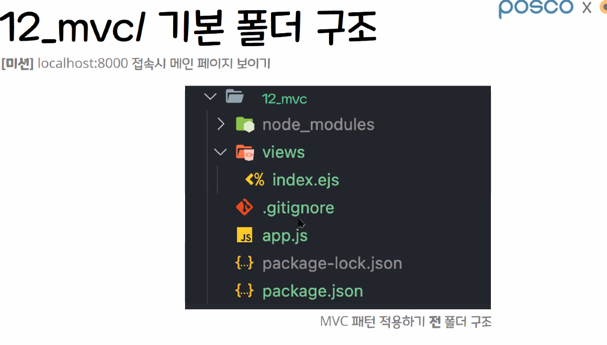

#### `0404`

# MVC
* **Model View Controller**  
소프트웨어 설계와 관련된 디자인 패턴 ( 디자인 패턴 :상황에 따라 설계 방법을 정리한 코딩 방법론)
> ## 장점
> * 패턴들을 구분해 개발한다
> * 유지 보수가 용이하다.
> * 유연성이 높다
> * 확장성이 높다.
> * 협업에 용이하다.

> ## 단점
> * 완벽한 의존성 분리가 어렵다  
> * **설계 단계가 복잡하다**  
> * 설계 시간이 오래걸린다.  
> * 클래스(단위)가 많아진다.

## MVC 흐름
  '
* **Model** : 데이터를 처리하는 부분 ( model 폴더 )
* **View** : UI 관련된 것을 처리하는 부분 ( 사용자에게 보여지는 부분 ) CSS / HTML 
* **Contorller** : View 와 Model 을 연결해주는 부분

## Node.js 에서 MVC 구조

