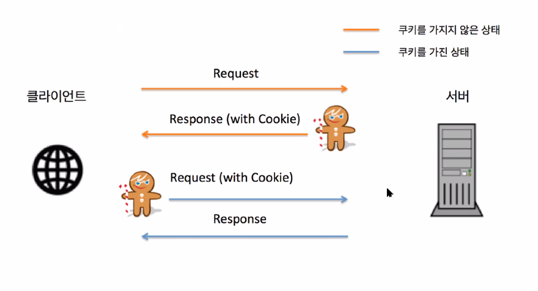

#### `0410`

# 쿠키
* 쿠키나 세션을 이용해서 어떤 이용자가 요청한건지 알 수 있따

## 쿠키의 동작 방식
* 클라이언트가 페이지를 요청
* 서버에서 쿠키를 생성
* HTTP 헤더에 쿠키를 포함 시켜 응답
* 브라우저가 종료되어도 쿠키 만료 기간이 있다면 클라이언트에서 보관하고 있음
* 같은 요청을 할 경우 HTTP 헤더에 쿠키를 함께 보냄
* 서버에서 쿠키를 읽어 이전 상태 정보를 변경 할 필요가 있을 때 쿠키를 업데이트 하여 
  변경된 쿠키를 HTTP헤더에 포함시켜 응답

