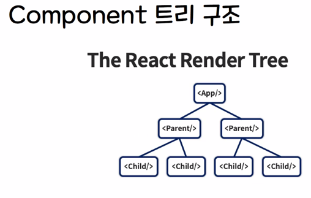

* ...rest 파라미터 // 나머지 매개변수  
  파라미터의 개수를 모를때 ...rest 를 작성함.

# REACT

## Virtual DOM

* 기존에는 html 작성후 그안에 JS 작성

```jsx

<body>
<span>현재 시간은</span>
</body>;
<script>
    (function () {
    const span = document.querySelector('span')
    setInterval = (()=>{
    span.innerText= `현재 시간은${ new DAte().toLocaleTimesTring() }`
},1000) };})();;
```

* javascript 는 지속적으로 DOM(태그) 을 갱신시킨다
* 리액트의 virtual DOM 은 비교 후 변화가 있는 요소만 갱신시킨다.
```
export 함수는 
import { 함수명 } from 
export default 함수는
import 함수 from
```

## Component
* React 의 꽃이라 불리는 React 의 핵심
* 함수형 Component  : 짧고 직관적 // 


* 아토믹 디자인에 따라 컴포넌트 설계를 하는게 좋음.


## props 
* 부모컴포넌트에게 데이터를 받아와서 화면에 출력할 때 사용 할 수있다.  
  (props를 사용하지 않을경우, component의 재사용성이 떨어짐)
