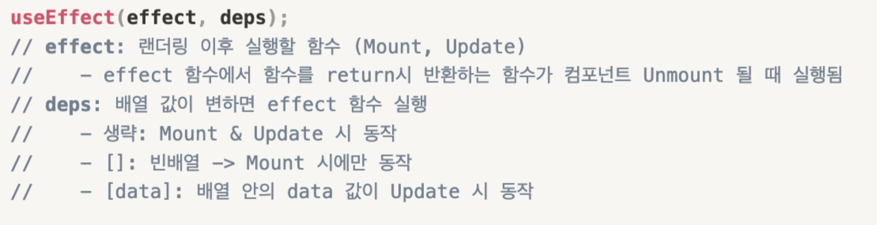
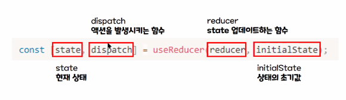
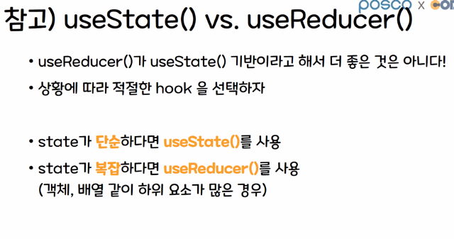
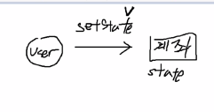
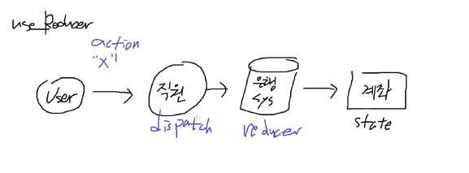

# Hook

# useEffect



# useMemo

* 연산을 최적화하는 Hook
* Rendering 과정에서 특정값이 바뀌었을 때 연산을 실행한다.
  `const memoizedValue = useMemo(callback,dependency);`
* 렌더링 과정에서 두번째 인자 (dependency)의 값이 바뀌는경우, callback함수를 실행
*

# useCallback

* 함수를 재사용할 때 씀 (useMemo는 값을 기억할 때 씀 )

```js
// useCallback vs useMemo
// const meoizedCallback = useCallback(function,deps);
// const memoizedValue = useMemo(()=>function,deps);
// useCallback : useMemo를 기반으로 만든 hook
// 단 함수를 사용 할 때 편의성을 증진시킨 Hook

// 공통점 : 성능 최적화
// 차이점 
// - useMemo : 값을 재사용 => 값의 재사용을 위해 전달된 함수를 실행하고 그 결과를 메모이제이션
// - useCallback : 함수를 재사용 => 함수의 재사용을 위해 전달된 함수 자체를 메모이제이션
```

# useReducer();

* Reducer 란, 현재상태와 업데이트를 위해 필요한 정보를 담은 액션 값을 전달받아
* 새로운 상태를 반환하는 함수
  
  `const [state,dispatch] = useReducer(reducer,'초기값')`
* 장점 : 컴포넌트 업데이트 로직을 컴포넌트 외부로 뺄 수 있음
* useReducer 는 useState의 대체 함수 다양한 컴포넌트 상황에 따라 상태값을 설정 할 수 있음
*
  1. reducer 정의
*
  2. dispatch함수로 action 값을 전달
*
  3. Reducer : 현재 state와 action 값을 전달 받아 새로운 state 반환 ;



* 복잡하면 useReducer, 간단하면 useState

## useState :


## useReducer :


 * **useReducer의 기본값이 객체 일 경우, action들도 다 객체로 바꿔줘야한다**
